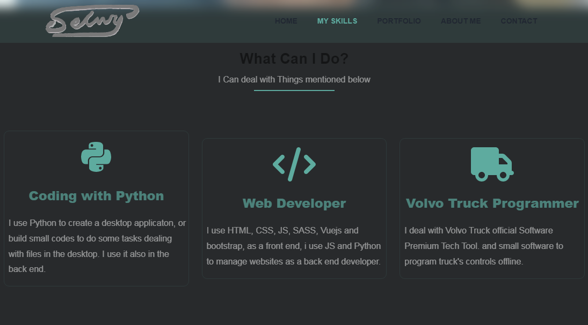
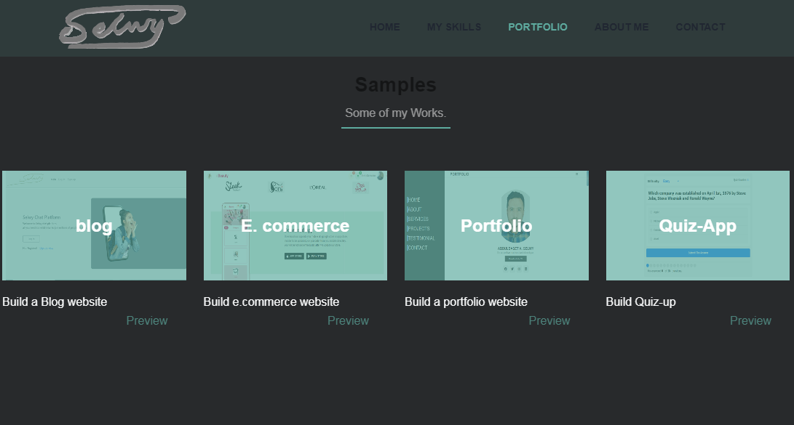
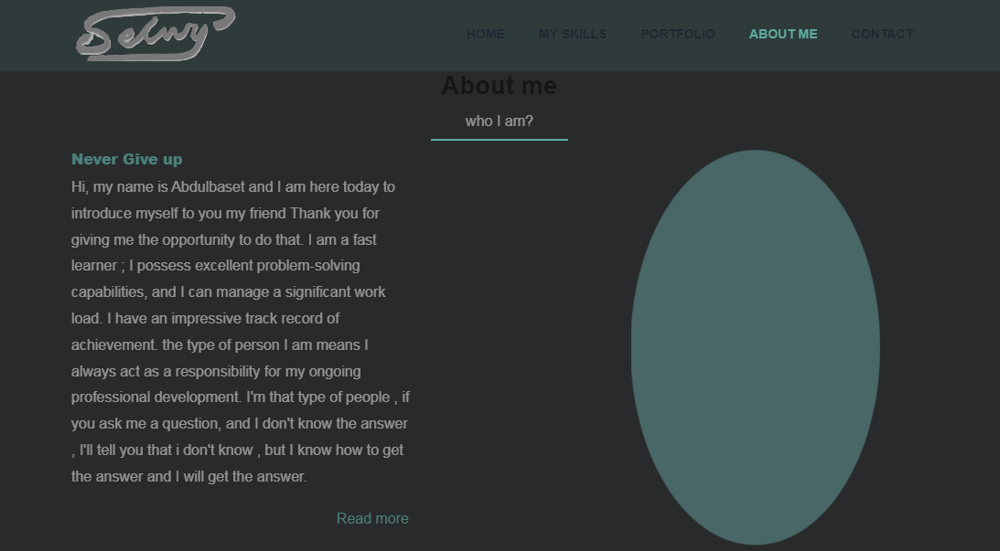

# My-Portfolio-Website

AMy-Portfolio-Website coding by HTML, CSS and Javascript , with Bootstrap

 

        

            
        

        

            
        

        

            
        

        

            
        

        

            
        

    

