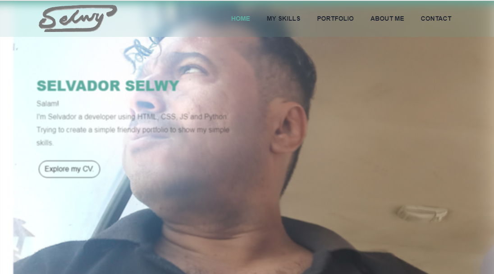

# My-Portfolio-Website

AMy-Portfolio-Website coding by HTML, CSS and Javascript , with Bootstrap

 

        

            
        

        

            
        

        

            
        

        

            
        

        

            
        

    

# My-Portfolio-Website

My own portfolio build using HTML, CSS, JS and Bootstrap.
plan to develop it and make it my real portfolio website. with a real domain.
